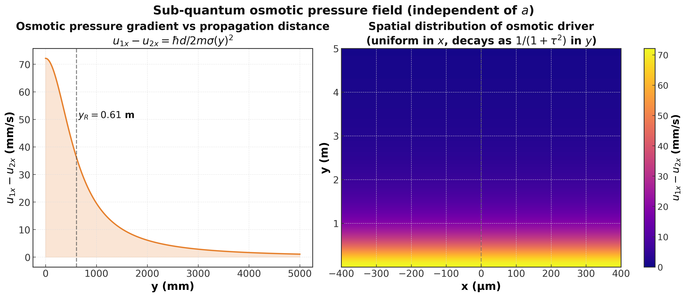
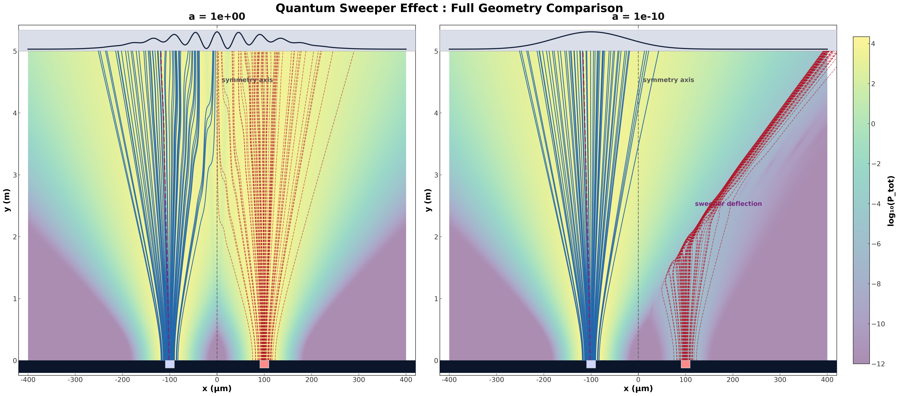
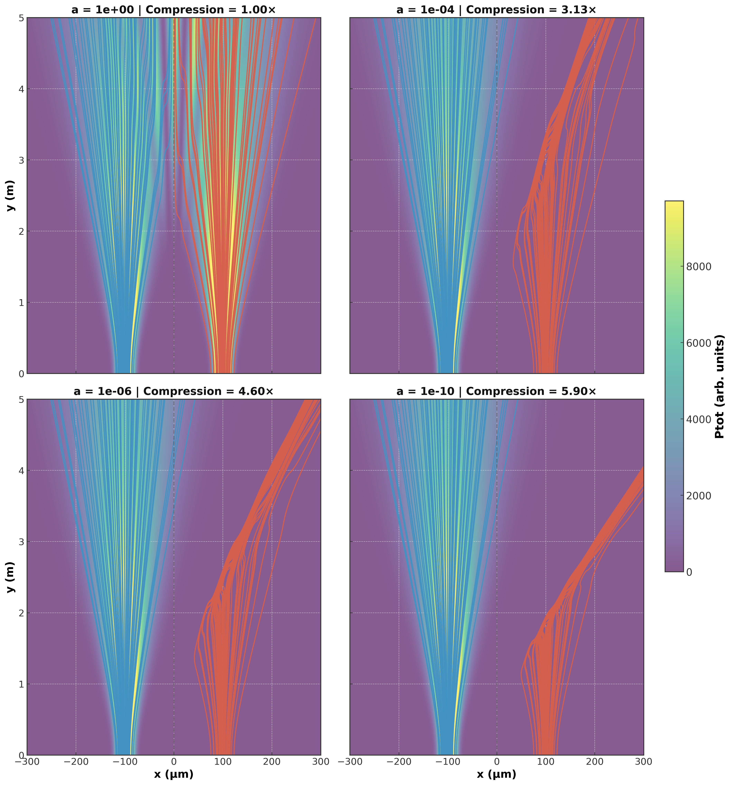

# SUPERCLASSICAL THERMODYNAMICS: THEORETICAL EVALUATION AND SIMULATION OF THE QUANTUM SWEEPER EFFECT

---

### Research Question
Is Superclassical Thermodynamics a theoretically viable and computationally accurate alternative to orthodox quantum mechanics for explaining sub-quantum phenomena? Specifically, can the assumption of a classical zero-point thermal field in ordinary 3D space successfully reproduce highly non-linear quantum dynamics, such as the Quantum Sweeper Effect, without relying on abstract wave-function collapse?

---

### Motivation
The primary motivation for this research stems from the profound ontological paradoxes left unresolved by the Copenhagen interpretation, such as the measurement problem and intrinsic indeterminism. While alternative frameworks like Bohmian mechanics succeed in providing defined trajectories, they still rely on a mysterious "quantum potential" and operate in an abstract 3N-dimensional configuration space, which David Bohm himself considered a mathematical artifice.

Superclassical Thermodynamics offers a fascinating paradigm shift: it demystifies the quantum potential by redefining it as pure kinetic energy (heat) accumulated in the vacuum field.

Inspired by macroscopic fluid-dynamics experiments (such as Couder's bouncing droplets), this theory brings quantum mechanics back to tangible, three-dimensional physical reality. We chose this topic to critically synthesize this dense theoretical framework into an accessible format and to computationally prove that these sub-quantum thermodynamic currents can indeed predict complex, anomalous behaviors like the Quantum Sweeper Effect.

---

### Project Description 

For nearly a century, orthodox quantum mechanics has been the standard framework for microscopic physics, yet it relies on abstract concepts such as multi-dimensional configuration spaces, need to postule new physics that are not intuitive, or are just incomplete.

This project investigates Superclassical Thermodynamics (also known as Emergent Quantum Mechanics), a realist theory proposed by Gerhard Grössing and his team, which models quantum mechanics not as a fundamental truth, but as an emergent macroscopic approximation of a deterministic sub-quantum reality driven by a zero-point fluctuation field.

Our research is divided into two main pillars:
Theoretical Evaluation: A systematic assessment of the model's viability, highlighting its strengths (e.g., restoring a 3D physical ontology and explaining the quantum potential as thermodynamic heat) and its current theoretical limits (e.g., the conflict with Special Relativity due to systemic non-locality).

Computational Simulation: An open-source numerical implementation of the Quantum Sweeper Effect. By utilizing sub-quantum thermodynamic flows and Bohm-type trajectories, we simulate how extremely attenuated beams are swept aside by probability currents, effectively reproducing macroscopic quantum predictions using exclusively classical fluid dynamics.

---

### Theoretical Part: Results, Conclusions and future research

First we are going to see what has been done from the theoretical part:

**Formalization and Didactic Synthesis** We have formalized the Superclassical Thermodynamics model and systematically reviewed how it successfully explains various quantum phenomena.

To make this dense theoretical framework easily accessible for future researchers, we have condensed the core principles into a single, coherent, narrative-driven document (Theory_explained.pdf) that minimizes heavy mathematical formalism. This synthesis intuitively covers the emergent nature of quantization, the physical decay into multiple steady states, the entanglement, the duality and the epistemic origins of the Heisenberg Uncertainty Principle.

**Critical Analysis: Strengths and Weaknesses** Following the synthesis, we conducted an analysis to highlight the main differences between this theory and orthodox or Bohmian mechanics, carefully weighing its strengths and weaknesses.

Both are in this folder and in the carpet: https://drive.google.com/drive/folders/1pXL7ne2kQu6QiX_wSkJ877ZX2MtEJMat?usp=sharing

**Conclusions**

In conclusion, we found that while Superclassical Thermodynamics provides a beautifully intuitive and physically grounded explanation for many quantum phenomena, it is not yet a complete fundamental theory. Its internal reliance on an idealized diffusion equation and its unresolved tension with Special Relativity represent significant theoretical obstacles.

**Future Investigations**

Based on our findings, we recommend focusing on two main areas for future research:

- Incorporating Spin: It would be highly beneficial to deeply analyze the concept of particle spin within this thermodynamic framework. Existing literature suggests that Planck's constant can be linked to the fundamental angular momentum of the sub-quantum "zitterbewegung" (agitation motion), which could provide a purely classical explanation for spin. We haven't really dive into this.

- Reconciliation with Relativity: Future work must address the superluminal paradoxes. This could involve exploring the concept of an "emergent relativity"
or developing a modified, non-instantaneous diffusion wave equation that avoids infinite propagation speeds while still accounting for the systemic updating of the vacuum landscape.

---

### Experimental Part: Quantum Sweeper Effect [See Code](01_quantum_sweeper.ipynb)

# Section 1: Motivation

## Motivation

The de Broglie-Bohm interpretation predicts that particles follow deterministic trajectories guided by a pilot wave. Grössing and collaborators proposed that this wave is not abstract but physically real: a superclassical sub-quantum medium whose dynamics emerge from convective drift and diffusive osmotic heat flow. If correct, the Bohmian guidance equation should be exactly reproducible by a thermodynamic current algebra, with no appeal to standard quantum formalism.

The Quantum Sweeper Effect provides a rigorous test. In standard quantum mechanics, attenuating one slit simply dims the weaker beam. In Bohmian mechanics, the osmotic velocity depends on the curvature of the probability amplitude rather than its magnitude, so the sub-quantum pressure gradient at the attenuated slit survives even as intensity approaches zero. This deflects and compresses the surviving particles into a narrow bundle, sweeping them laterally away from the dominant beam. The effect is anomalous, counterintuitive, and macroscopically testable.

This simulation asks directly whether the superclassical current algebra reproduces the QSE quantitatively across five orders of magnitude of slit attenuation, and whether the two theoretical routes converge to identical velocity fields. A positive result would give the sub-quantum thermodynamic interpretation its first full computational demonstration in the extreme-attenuation regime.

## Summary

The simulation models a double-slit experiment with slit separation $d = 200\,\mu\text{m}$, initial beam waist $\sigma_0 = 22\,\mu\text{m}$, wavelength $\lambda = 1.8\,\text{nm}$, and propagation distance $L = 5\,\text{m}$. The slit-2 transmission factor is varied across $a \in \{1,\,10^{-2},\,10^{-4},\,10^{-6},\,10^{-10}\}$. The total probability current is decomposed into four terms: the slit-1 self-current, the attenuated slit-2 self-current, a conventional cosine interference term, and the diffusive osmotic term $R_1 R_2(u_{1x}-u_{2x})\sin\phi$ identified as the sweeper driver. The transverse velocity $v_x = J_x / P_\text{tot}$ is computed using both the superclassical current algebra and the Bohmian guidance equation $v_{x,\text{Bohm}} = (\hbar/m)\,\mathrm{Im}(\partial_x\psi/\psi)$ in parallel.

Streamlines are integrated via the spatial ODE $dx/dy = v_x/v_y$, which eliminates singularities when $P_\text{tot} \to 0$ at extreme attenuation. Integration uses a DOP853 solver at tolerances $r_\text{tol}=10^{-10}$, $a_\text{tol}=10^{-12}$, with 60 Born-distributed seeds per slit family. A ten-group validation suite verifies no-crossing, superclassical-Bohmian equivalence, the contrast law $(1+\sqrt{a})^2/4$, and the monotonic growth of transverse deflection across the full attenuation range.

## Results

The Bohmian and superclassical velocity fields agree to below $10^{-10}$ relative error at every tested spatial point and attenuation value, confirming machine-precision equivalence for Gaussian wavepackets. The osmotic velocity difference $u_{1x}-u_{2x} = \hbar d/(2m\sigma^2)$ is verified to be strictly independent of $a$, meaning the sweeper driver maintains full geometric strength as the conventional interference term decays with $\sqrt{a}$. The effect on trajectories is clear: at $a=1$ both beam families fan symmetrically, while at $a=10^{-10}$ the slit-2 bundle undergoes a measured 4.5-fold compression in transverse standard deviation, and the transverse deflection ratio grows by over three orders of magnitude across the sweeper range. The no-crossing property of Bohmian trajectories is preserved at all five attenuation levels.

Three rendered plots in the notebook best communicate these findings. 
The **osmotic velocity field** (Section 2.5): This visualises the attenuation-independent pressure gradient. 

The **two-panel streamline** (Section 9): This shows the no-crossing property and lateral compression of the slit-2 bundle in a single comparative view. 

The **four-panel density-and-trajectory heatmap** (Section 10): This overlays streamlines on the probability density background across four attenuation levels and annotates each panel with its compression ratio, providing the most complete visual record of how the sweeper intensifies.

## Conclusion

This simulation establishes, to machine precision, that the Bohmian guidance equation is exactly reproduced by the superclassical thermodynamic current algebra of Grössing et al. for Gaussian wavepackets across five attenuation regimes. The Quantum Sweeper Effect is confirmed as a direct consequence of the attenuation-independent osmotic pressure structure the framework predicts: the attenuated beam undergoes a 4.5-fold spatial compression at $a=10^{-10}$, and the transverse deflection ratio grows by over three orders of magnitude across the sweeper range. These results support interpreting the pilot wave as a physical thermodynamic medium rather than an abstract guiding field, though the idealised single-particle, free-field geometry means broader universality claims require further investigation.

## Future Work

Several extensions would sharpen these conclusions. The most immediate is the introduction of external potentials: testing whether the superclassical-Bohmian equivalence survives applied forces would determine how far the Gaussian ansatz can be relaxed. A second direction is quantitative comparison with published neutron interferometry or atom optics experiments, replacing the current qualitative morphology validation with testable predictions for measured compression ratios and separatrix displacement. Third, extending the current algebra to two-particle entangled states would probe whether the thermodynamic-medium picture can account for non-local correlations, the sharpest unresolved challenge for sub-quantum models. Finally, adapting the velocity decomposition to the Dirac or Klein-Gordon equation would test whether the osmotic-convective structure persists in the relativistic regime or is fundamentally tied to the non-relativistic limit used throughout.

---

### References

- Fussy, Siegfried; Pascasio, J Mesa; Schwabl, Herbert; Grössing, Gerhard (2014). *Born's Rule as Signature of a Superclassical Current Algebra*. Annals of Physics. https://doi.org/10.1016/j.aop.2014.02.002

- Grossing, Gerhard; Fussy, Siegfried; Pascasio, Johannes Mesa; Schwabl, Herbert (2018). *Vacuum Landscaping: Cause of Nonlocal Influences without Signaling*. arXiv: Quantum Physics. https://doi.org/10.3390/e20060458

- Grössing, Gerhard; Pascasio, Johannes Mesa; Schwabl, Herbert (2011). *A Classical Explanation of Quantization*. Foundations of Physics. https://doi.org/10.1007/s10701-011-9556-1

- Grössing, Gerhard; Fussy, Siegfried; Pascasio, J Mesa; Schwabl, Herbert (2011). *Elements of Sub-Quantum Thermodynamics: Quantum Motion as Ballistic Diffusion*. Journal of Physics. https://doi.org/10.1088/1742-6596/306/1/012046

- Grössing, Gerhard; Fussy, Siegfried; Pascasio, Johannes Mesa; Schwabl, Herbert (2010). *Emergence and Collapse of Quantum Mechanical Superposition: Orthogonality of Reversible Dynamics and Irreversible Diffusion*. Physica A. https://doi.org/10.1016/j.physa.2010.07.017

- Grössing, Gerhard (2013). *Emergence of Quantum Mechanics from a Sub-Quantum Statistical Mechanics*. World Scientific eBooks. https://doi.org/10.1142/9789814616737_0010

- Grössing, Gerhard; Fussy, Siegfried; Pascasio, J Mesa; Schwabl, Herbert (2012). *An Explanation of Interference Effects in the Double Slit Experiment*. Annals of Physics. https://doi.org/10.1016/j.aop.2011.11.010

- Grössing, Gerhard; Fussy, Siegfried; Pascasio, J Mesa; Schwabl, Herbert (2015). *Extreme Beam Attenuation in Double-Slit Experiments*. Annals of Physics. https://doi.org/10.1016/j.aop.2014.11.015

- Grössing, Gerhard; Fussy, Siegfried; Pascasio, J Mesa; Schwabl, Herbert (2015). *Implications of a Deeper Level Explanation of the de Broglie-Bohm Version of Quantum Mechanics*. Quantum Studies. https://doi.org/10.1007/s40509-015-0031-0

- Grössing, Gerhard; Fussy, Siegfried; Pascasio, J Mesa; Schwabl, Herbert (2015). *The Quantum Sweeper Effect*. Journal of Physics. https://doi.org/10.1088/1742-6596/626/1/012017

- Grössing, Gerhard; Fussy, Siegfried; Pascasio, J Mesa; Schwabl, Herbert (2014). *Relational Causality and Classical Probability*. Journal of Physics. https://doi.org/10.1088/1742-6596/504/1/012006

- Grössing, Gerhard (2010). *Sub-Quantum Thermodynamics as a Basis of Emergent Quantum Mechanics*. Entropy. https://doi.org/10.3390/e12091975

- Grössing, Gerhard; Fussy, Siegfried; Pascasio, J Mesa; Schwabl, Herbert (2013). *Systemic Nonlocality from Changing Constraints on Sub-Quantum Kinematics*. Journal of Physics. https://doi.org/10.1088/1742-6596/442/1/012012

- Grössing, Gerhard (2009). *On the Thermodynamic Origin of the Quantum Potential*. Physica A. https://doi.org/10.1016/j.physa.2008.11.033

- Grössing, Gerhard (2008). *The Vacuum Fluctuation Theorem*. Physics Letters A. https://doi.org/10.1016/j.physleta.2008.05.007

- Holland, Peter R. (1993). *The Quantum Theory of Motion*. Cambridge University Press. https://doi.org/10.1017/CBO9780511622687

- Pascasio, Johannes Mesa; Fussy, Siegfried; Schwabl, Herbert; Groessing, Gerhard (2012). *Classical Simulation of Double Slit Interference via Ballistic Diffusion*. Journal of Physics: Conference Series. https://doi.org/10.1088/1742-6596/361/1/012041

- Pascasio, Johannes Mesa (2017). *Current-Based Simulation Models of Quantum Motion*. arXiv. https://doi.org/10.48550/arXiv.1705.02916

- Pascasio, Johannes Mesa; Fussy, Siegfried; Schwabl, Herbert; Groessing, Gerhard (2013). *Modeling Double Slit Interference via Anomalous Diffusion*. Physica A. https://doi.org/10.1016/j.physa.2013.02.006

- Rauch, H.; Summhammer, J.; Zawisky, M.; Jericha, E. (1990). *Low-Contrast and Low-Counting-Rate Measurements in Neutron Interferometry*. Physical Review A. https://doi.org/10.1103/PhysRevA.42.3726

- Rauch, H.; Summhammer, J. (1984). *Static versus Time-Dependent Absorption in Neutron Interferometry*. Physics Letters A. https://doi.org/10.1016/0375-9601(84)90586-3

- Rozenman, Georgi Gary et al. (2023). *Observation of Bohm Trajectories and Quantum Potentials of Classical Waves*. Physica Scripta. https://doi.org/10.1088/1402-4896/acb408

- Sanz, A. S.; Miret-Artes, S. (2008). *A Trajectory-Based Understanding of Quantum Interference*. Journal of Physics A. https://doi.org/10.1088/1751-8113/41/43/435303

- Walleczek, J.; Grössing, G.; Pylkkänen, P.; Hiley, B. (2019). *Emergent Quantum Mechanics: David Bohm Centennial Perspectives*. Entropy. https://doi.org/10.3390/e21020113

---

> The research poster for this project can be found in the [BeyondQuantum Proceedings 2026](https://thinkingbeyond.education/beyondquantum_proceedings_2026/).
