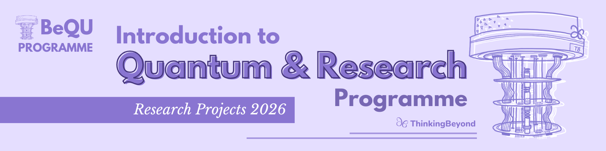

# Qubit Manipulation in Quantum Circuits - Implementing Deutsch and Deutsch-Jozsa Algorithm for 2- and 3- and 4-Qubit Systems

## Overview

There are only four possible functions of the form $$\{0,1\}\rightarrow \{0,1\}$$, which are the following:

| $$x$$  | $$f_1$$ | $$f_2$$ | $$f_3$$ | $$f_4$$ |
| ------------- | ------------- | ------------- | ------------- | ------------- |
| 0 | 0 | 0 | 1 | 1 |
| 1  | 0 | 1 | 0 | 1 |

Classically, we may need two queries to guess if the function is either: 
* **Constant:** All outputs are the same.
* **Balanced:** Half outputs are 0s and half outputs are 1s.

However, Deutsch Algorithm made a conceptual proof that with a single query and a quantum computer we could get the most important characteristic of this function. This project explores the implementation of this algorithm and its natural succesor on the question of: How could we guess a function of the form $$f: \{0,1\}^n \rightarrow \{0,1\}$$

***Provide a description of your project including*** 

1. motivating your research question
2. stating your research question
3. explaining your method and implementation
4. Briefly mention and discuss your results
5. Draw your conclusions
6. State what future investigations 
7. State your references 

### Further Guidance: Formating
- Structure this readme using subsections
- Your job is to 
    - keep it clear
    - provide sufficient detail, so what you did is understandable to the reader. This way other researchers and future cohorts of BeyondQuantum will be able to build on your research
    - List all your references at the end
- utilise markdown like *italics*, **bold**, numbered and unnumbered lists to make your document easier to read
- if you refer to links use the respective markdown for links, e.g. `[ThinkingBeyond](https://thinkingbeyond.education/)`
- If you have graphs and pictures you want to embed in your file use ``
- If you want to present your results in a table use
    | Header 1            | Header 2  |
    |---------------------|-----------|
    | Lorem Ipsum         | 12345     |

**Tip:** Use tools to create markdown tables. For example, Obsidian has a table plugin, that makes creating tables much easier than doing it by hand.

## Research Question

How can we implement the Deutsch Algorithm to functions $$f: \{0,1\} \rightarrow \{0,1\}$$ and the Deutsch-Jozsa Algorithm to functions  $$f: \{0,1\}^2 \rightarrow \{0,1\}$$ and $$f: \{0,1\}^3 \rightarrow \{0,1\}$$?

## Motivation

Our main aim at this project is to evidence whether Deutsch and Deutsch-Jozsa Algorithms are an accurate approach to solve the main characteristic of $$f: \{0,1\}^n \rightarrow \{0,1\}$$-like functions.

## Your next subsection

Continue working through the points listed above with the help of sensibly named subsections. 

If you want to see some good examples of README files check out:
- [Example 1](https://github.com/ThinkingBeyond/BeyondAI-2024/blob/main/warenya-loulia/README.md)
- [Example 2](https://github.com/ThinkingBeyond/BeyondAI-2024/blob/main/shaana-karuna/README.md)

[ ... ]

## Future Work

Using the same methods as the research, Deutsch-Jozsa Algorithm could be tested to 5-, 6- and 7- Qubit Systems to test whether the accuracies of prediction have a tendency depending on the functions. Future Research could be built upon instituting Error Correction into the "unknown" oracle, so in this way we could have a perfect oracle with an imperfect algorithm and then just test the effectiveness of Deutsch and Deutsch-Jozsa Algorithm by itself.

## References

* Cleve, R., Ekert, A., Macchiavello, C., & Mosca, M. (1998). *QUANTUM ALGORITHMS REVISITED*. Proceedings of The Royal Society A: Mathematical, Physical and Engineering Sciences. [https://doi.org/10.1098/rspa.1998.0164](https://doi.org/10.1098/rspa.1998.0164)
* Deutsch, D. (1985). *Quantum theory, the Church–Turing principle and the universal quantum computer*. Proceedings of the Royal Society of London. A. Mathematical and Physical Sciences. [https://doi.org/10.1098/rspa.1985.0070](https://doi.org/10.1098/rspa.1985.0070)
* Deutsch, D., & Jozsa, R. (1992). *Rapid solution of problems by quantum computation*. Proceedings of the Royal Society of London. Series A: Mathematical and Physical Sciences. [https://doi.org/10.1098/rspa.1992.0167](https://doi.org/10.1098/rspa.1992.0167)
* Jaradat, Y., Alia, M., Masoud, M., Mansrah, A., Jannoud, I., & Alheyasat, O. (2023). *Roadmap for Simulating Quantum Circuits Utilising IBM’s Qiskit Library: Programming Approach*. The Eurasia Proceedings of Science, Technology, Engineering & Mathematics. [https://doi.org/10.55549/epstem.1412445](https://doi.org/10.55549/epstem.1412445)
* Javadi-Abhari, A., Treinish, M., Krsulich, K., Wood, C. J., Lishman, J., Gacon, J., Martiel, S., Nation, P. D., Bishop, L. S., Cross, A. W., Johnson, B. R., & Gambetta, J. M. (2024). *Quantum computing with Qiskit*. [https://arxiv.org/abs/2405.08810](https://arxiv.org/abs/2405.08810)
* Kothari, K., & Chaudhuri, R. P. (2025). *Qubit Manipulation in Quantum Circuits—Solving Grover’s Algorithm for 2- and 3-Qubit Systems*. Beyond Quantum Proceedings 2025.
* Nakahara, M., & Ohmi, T. (2008). *Quantum Computing—From Linear Algebra to Physical Realizations*. En *Quantum Computing: From Linear Algebra to Physical Realizations*. [https://doi.org/10.1201/9781420012293](https://doi.org/10.1201/9781420012293)
* Nielsen, M. A., & Chuang, I. L. (2010). *Quantum Computation and Quantum Information: 10th Anniversary Edition*. Cambridge University Press.
* *Noise Analysis of Grover’s Quantum Search Algorithm*. (2023). Indian Journal of Pure & Applied Physics. [https://doi.org/10.56042/ijpap.v61i5.69090](https://doi.org/10.56042/ijpap.v61i5.69090)
* Textbook, Q. (s. f.). *Learn Quantum Computation using Qiskit* [Manuscript].
* Weathers, J. M. (2010). *Methods for quantum circuit design and simulation*. Calhoun: The NPS Institutional Archive DSpace Repository.
* Youvan, D. C. (2023). *Quantum Oracles: Design, Implementation, and Implications in Quantum Search Algorithms*. [https://doi.org/10.13140/RG.2.2.27075.78884](https://doi.org/10.13140/RG.2.2.27075.78884)

---

> The research poster for this project can be found in the [BeyondQuantum Proceedings 2026](https://thinkingbeyond.education/beyondquantum_proceedings_2026/).

