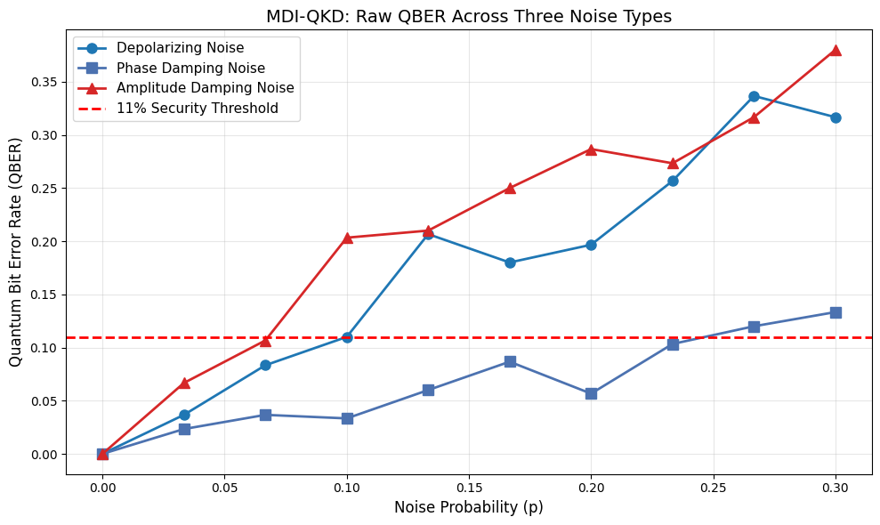
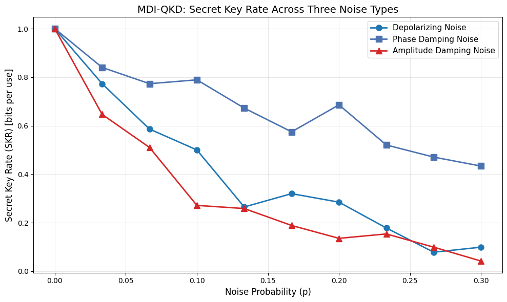
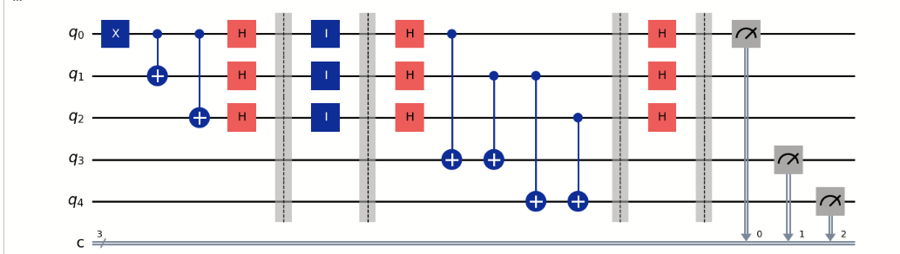
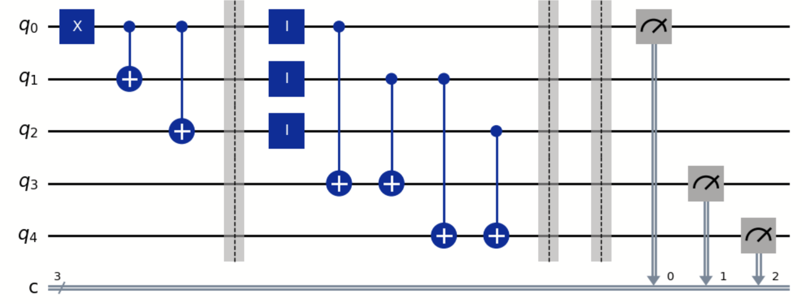
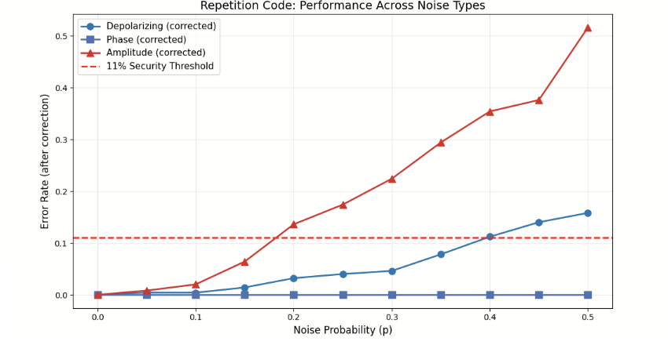
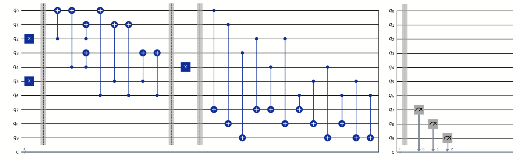
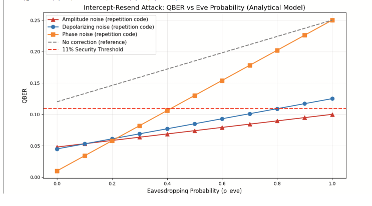

# QBER STABILITY IN MDI-QKD UNDER QUANTUM NOISE AND EAVESDROPPING 

## Sections of our research
- A comparative analysis of three quantum noise channels in Measurement-Device-Independent Quantum Key Distribution (understanding the problem)
- An implementation of a 3-qubit repetition code for noisy quantum channels (the simple fix)
- The exploration of classical Hamming decoding and Steane-style quantum error correction challenges (The more complex fix)
- An Analysis of QBER stability under intercept-resend attacks (further testing)
- Observation of potential “Eve masking” effects during classical-style correction (links to the future)

## Research Question

How do different types of quantum noise (depolarising, phase damping, amplitude damping) and eavesdropping attacks affect the stability of the QBER in MDI-QKD, and to what extent can simple error correction strategies (such as repetition code and Hamming code) mitigate these effects to improve secure key generation?

## Motivation

As Quantum computing and, therefore, quantum communication advance and become more widespread, the need for secure communication will only increase. Once it is implemented into critical infrastructure, such as hospitals for medical imaging, as seen in one of the other groups in the cohort, secure quantum communication will become more than just a preference; it will be a requirement. This has led to developments in quantum communication algorithms, such as BB84 and E91, as Askia Isla and Irene Gallini found in their project last year on this topic. However, both of those are flawed, which is why MDI-QKD was created. This algorithm uses Bell-state measurements and introduces a third party into the equation, thereby making the communication between A and B secure.

However, measurement-device-independent quantum key distribution is vulnerable to noise. Increasing the noise to make the quantum bit error rate above 11%, and the whole algorithm stops functioning. This means that whilst in theory, MDI QKD is secure, in practise, the real-world noise it faces is a major problem. Hence, this year we decided to dedicate our project to address this real-world issue, to make the algorithm usable.

To approach this problem realistically, we modelled three major quantum noise channels (amplitude damping, phase damping, and depolarising noise) using Qiskit simulations, and then analysed how both error correction and eavesdropping attacks affected the QBER and the Secret Key Rate (SKR). Instead of immediately relying on highly theoretical fault-tolerant quantum codes that remain difficult to implement on modern hardware, we first explored simpler, more practical correction methods, such as repetition coding and Hamming-based techniques, to evaluate the improvements realistically achievable in near-term quantum systems.

## Key Terms and Definitions shown in this research (Advanced and basic versions)
Quantum Key Distribution is a cryptographic method that uses quantum mechanics to allow two parties to securely generate a shared secret key. (Think of it like a password that is secret - so only A and B and communicate - no one else can join in)

#### Measurement-Device-Independent QKD (MDI-QKD):
A QKD protocol designed to eliminate detector-side attacks by introducing an untrusted intermediary (“Charlie”) who performs Bell-state measurements without learning the final key. Currently, it is amongst the most secure quantum cryptography algorithms, significantly better than E91 or BB84. (It's the best "key" version generator we have)

#### Quantum Bit Error Rate (QBER):
The percentage of bits received incorrectly during quantum communication. High QBER indicates either strong environmental noise, eavesdropping, or both. (It's a measure of how successful the communication between A and B is in terms of % or as a decimal from 0 to 1)

#### Amplitude Damping Noise:
A noise channel representing energy loss, such as photon absorption, where quantum states decay from |1⟩ to |0⟩. (We can think of this as the loss of energy - the photons just stop there)

#### Phase Damping Noise (Dephasing):
A noise process that destroys quantum coherence without changing the energy state of the qubit. (this is where the superposition gets removed - it stops being quantum)

#### Depolarising Noise:
A noise channel that randomly alters the quantum state in quantum systems. (We can think of this as white noise / static - it's just random.) 

#### Intercept-Resend Attack:
An eavesdropping strategy in which an attacker (Eve) measures transmitted qubits and sends replacement states, introducing detectable errors into the channel. (This is because when we measure something in quantum mechanics, we remove information about it.)

#### Quantum Error Correction (QEC):
Methods that protect quantum information from noise by encoding logical qubits into multiple physical qubits and correcting errors using syndrome measurements. (Basically, it deals with the noise, so it's no longer such a big issue.)

#### Secure Key Rate (SKR):
A measure of how successful the key generation is. (Essentially, how often is that password that we talked about earlier generated correctly.) 

##  

Our investigation followed four connected phases, moving from understanding quantum noise to testing security under active attack.

Phase 1 modelled three major quantum noise channels in MDI-QKD using Qiskit simulations: amplitude damping (energy loss), phase damping (loss of coherence), and depolarising noise (randomised states). We measured their impact on the Quantum Bit Error Rate (QBER) and Secret Key Rate (SKR) to identify which noise types most strongly threaten secure communication.

Phase 2 implemented a 3-qubit repetition code using quantum circuits and majority-vote decoding. This allowed us to test whether simple error correction could reduce QBER under realistic noisy conditions.

Phase 3 explored more advanced error correction through the Hamming [7,4,3] code and its quantum analogue, the Steane [[7,1,3]] code. We tested both matrix-based classical decoding and quantum circuit implementations with syndrome extraction, while also analysing the practical challenges of fault-tolerant quantum error correction.

Phase 4 introduced an intercept-resend eavesdropping attack (“Eve”) to evaluate how noise, error correction, and active attacks interact in MDI-QKD security.

## Results and Analysis
### Phase 1 — Noise in MDI-QKD

Simulations showed that different noise channels affect MDI-QKD very differently.

Amplitude damping produced the highest QBER and the fastest collapse of secure communication, reaching 39.0% QBER at p = 0.30. Depolarising noise showed similarly destructive behaviour, while phase damping remained comparatively stable and never crossed the 11% security threshold within the tested range. However, phase damping noise was the gentlest - so we implemented it first, then amplitude damping, then depolarising - although the last one has a very complex theoretical circuit design, so we decided to gloss over that for time's sake.

Because the secret key rate depends nonlinearly on QBER, small increases in error rapidly reduce secure key generation. Under amplitude damping, SKR nearly vanished by p ≈ 0.30, while phase damping still maintained usable key generation.

Main takeaway for this section of the research:
MDI-QKD is most vulnerable to amplitude damping and depolarising noise, while phase damping is significantly less destructive under Z-basis measurements. 
### Phase 2 — Repetition Code Error Correction

To reduce bit-flip-dominated errors, we implemented a 3-qubit repetition code with majority-vote correction.

The repetition code significantly lowered error rates for amplitude damping and depolarising noise. At p = 0.30:

Amplitude damping improved from 33.0% → 22.8% QBER
Depolarising improved from 14.8% → 5.4% QBER

However, the code showed no improvement in phase damping because it creates phase-flip (Z) errors rather than bit-flip (X) errors.

At high noise levels (p > 0.4), performance declined because multiple simultaneous qubit errors became common, exceeding the repetition code's correction capability.

Key finding:
Simple repetition coding can substantially improve MDI-QKD reliability against bit-flip dominated noise, but fails against phase-flip errors.

### Phase 3 — Hamming and Steane Codes

To overcome the limitations of repetition coding, we explored the Hamming [7,4,3] code and the Steane [[7,1,3]] quantum code.

The classical Hamming decoder successfully identified single-bit errors through parity-check matrices. We then attempted a quantum implementation using syndrome extraction circuits and ancilla qubits.
In addition to this, for the Hamming code, we tried: 1. the matrix-based approach, 2. the circuit-based approach, 3. the simple XOR approach and 4. the basic version before running into faults with all of them 

Although the full Steane implementation did not function correctly, the process revealed several important challenges in practical quantum error correction:

- Correct logical state encoding
- Fault-tolerant syndrome extraction
- Ancilla crosstalk and residual entanglement
- Error propagation during stabiliser measurements

Despite implementation difficulties, Steane theoretically offers major advantages over repetition coding because it can detect both bit-flip and phase-flip errors.

Key finding:
The gap between theoretical quantum error correction and practical implementation is substantial, even for relatively small codes such as Steane [[7,1,3]].

### Phase 4 — Eavesdropping and the Masking Problem

Finally, we introduced an intercept-resend attack to test whether error correction could maintain secure communication in the presence of active eavesdropping.

QBER increased linearly with Eve's attack probability, matching the theoretical relation:

QBER= 0.25p_eve + noise

The repetition code reduced QBER below the 11% security threshold for amplitude damping and depolarising noise:

- Amplitude damping: 18.5% → 7.4%
- Depolarising: 17.0% → 8.5%

However, phase damping remained above threshold at 13.0% because repetition codes cannot correct phase-flip errors.

This led to an important discovery: Eve masking.

Because the repetition code relies on measurement and majority voting, it behaves similarly to classical post-processing. As a result, Eve's interference can become hidden inside the corrected noise floor, making attacks difficult to distinguish from natural channel noise.

Key finding:
Classical-style correction can lower QBER while simultaneously masking eavesdropping activity. True quantum error correction would be required to distinguish natural noise from malicious interference through syndrome analysis.

## Overall Conclusions

This project demonstrates that the effectiveness of quantum error correction depends strongly on the physical type of noise present in the channel.

Amplitude damping and depolarising noise severely degrade MDI-QKD performance, but repetition coding can partially restore secure communication. Phase damping. presents a fundamentally different challenge because it introduces phase errors that are invisible to repetition-based correction.

Our exploration of Hamming and Steane codes showed that advanced quantum error correction could theoretically solve these limitations, but practical implementation remains highly complex due to fault-tolerance requirements.

Most importantly, our eavesdropping simulations revealed that lowering QBER alone is not sufficient for security. Classical-style correction may unintentionally conceal attacks within the natural noise floor, reinforcing the importance of true syndrome-based quantum error correction for future secure quantum networks.

## Future Work

This project showed that the effectiveness of quantum error correction depends strongly on the type of noise affecting the channel. While simple repetition codes improved performance against bit-flip dominated noise, they failed against phase-flip errors and introduced important security limitations such as Eve masking. Several promising directions remain open for future research. 

For example:

One natural continuation would be implementing true fault-tolerant quantum error correction using codes such as the Steane code, Shor, or surface codes. Unlike repetition coding, these methods preserve superposition during correction and could potentially distinguish natural noise from malicious interference through syndrome analysis. However, they require significantly more advanced stabilizer measurements, ancilla management, and fault-tolerant circuit design.

Another important direction is phase-flip correction. Our results showed that repetition codes cannot correct phase damping because they only address bit-flip errors. Future groups could explore CSS-based constructions or dedicated phase-flip codes to improve security in dephasing-dominated quantum channels such as long-distance fiber communication.

Our eavesdropping simulations also revealed the masking problem: error correction may reduce QBER while simultaneously hiding Eve’s activity within the corrected noise floor. Future research could investigate whether syndrome statistics, machine learning, or hybrid quantum-classical analysis can identify attack patterns that remain invisible to classical post-processing alone.

A particularly interesting possibility involves hybrid quantum-classical correction systems. This would that an input of quantum data to a classical algorithm would be possible. There has been very little work done in this field - it remains mostly untapped due to complications associated with it. We have talked about using machine learning or a series of converter algorithms in order to achieve this, but due to a lack of time, actually implementing this is a large area of interest. This would hypothetically allow classical infrastrucutre to be used for quantum communication, which is why it is an area of such high iterest, despite the numerous problems associated with its implementation

Finally, future projects could extend this work beyond discrete-variable MDI-QKD toward continuous-variable MDI-QKD, which may offer higher key rates and stronger compatibility with modern telecommunications infrastructure, but introduces much greater mathematical and experimental complexity.

## References

* **Basak, N., & Paul, G. (2025).** Resource Reduction in Multiparty Quantum Secret Sharing of both Classical and Quantum Information under Noisy Scenario. *arXiv preprint arXiv:2504.16709*.
* **Eater, B. (2020).** *What is error correction? Hamming codes in hardware*. YouTube. [Link](https://www.youtube.com/watch?v=h0jloehRKas)
* **Fletcher, A. I., et al. (2025).** An overview of CV-MDI-QKD. *Reports on Progress in Physics*, 88, 084001. [DOI: 10.1088/1361-6633/adf4f4](https://doi.org/10.1088/1361-6633/adf4f4)
* **Gisin, N., Ribordy, G., Tittel, W., & Zbinden, H. (2002).** Quantum cryptography. *Reviews of Modern Physics*, 74(1), 145–195. [DOI: 10.1103/RevModPhys.74.145](https://doi.org/10.1103/revmodphys.74.145)
* **Joseph, D., et al. (2022).** Transitioning organizations to post-quantum cryptography. *Nature*. [DOI: 10.1038/s41586-022-04623-2](https://doi.org/10.1038/s41586-022-04623-2)
* **Mermin, N. D.** *Quantum Computer Science: An Introduction*.
* **Preskill, J.** *Quantum Computing (CST Part II)*. University of Cambridge. [Link](https://www.cl.cam.ac.uk/teaching/1920/QuantComp/Quantum_Computing_Lecture_13.pdf)
* **Sanderson, G. [3Blue1Brown]. (2020).** *How to send a self-correcting message*. YouTube. [Link](https://www.youtube.com/watch?v=X8jsijhllIA)
* **Sanderson, G. [3Blue1Brown]. (2020).** *Hamming codes part 2, the elegance of it all*. YouTube. [Link](https://www.youtube.com/watch?v=b3NxrZOu_CE)
* **Shahid, A. B., et al. (2026).** Post-quantum cryptographic authentication protocol for industrial IoT using lattice-based cryptography. *Scientific Reports*, 16, 9582. [DOI: 10.1038/s41598-025-28413-8](https://doi.org/10.1038/s41598-025-28413-8)
* **Shi, S., et al. (2026).** Towards Minimal Fault-tolerant Error-Correction Sequence with Quantum Hamming Codes. *arXiv preprint arXiv:2601.10042*.
* **Subramani, S., et al. (2025).** Review of security methods based on classical cryptography and quantum cryptography. *Cybernetics and Systems*, 56(3), 302–320. [DOI: 10.1080/01969722.2023.2166261](https://doi.org/10.1080/01969722.2023.2166261)
* **Sun, Y., et al. (2025).** Analyzing the performance of CV-MDI QKD under continuous-mode scenarios. *Physical Review Applied*, 23, 014056. [DOI: 10.1103/PhysRevApplied.23.014056](https://doi.org/10.1103/PhysRevApplied.23.014056)
> The research poster for this project can be found in the [BeyondQuantum Proceedings 2026](https://thinkingbeyond.education/beyondquantum_proceedings_2026/).

