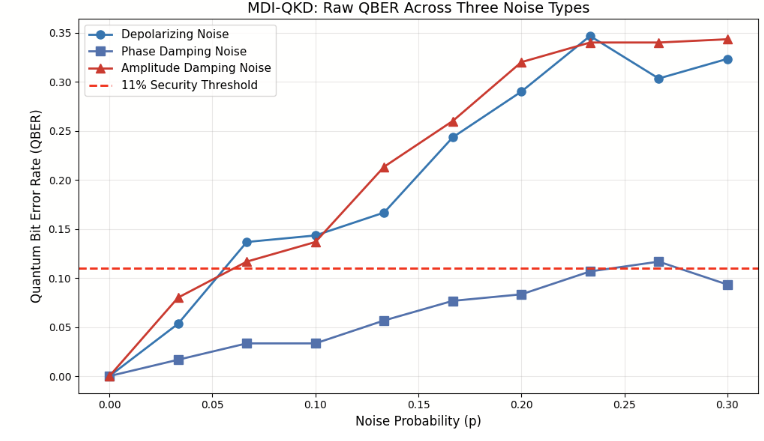
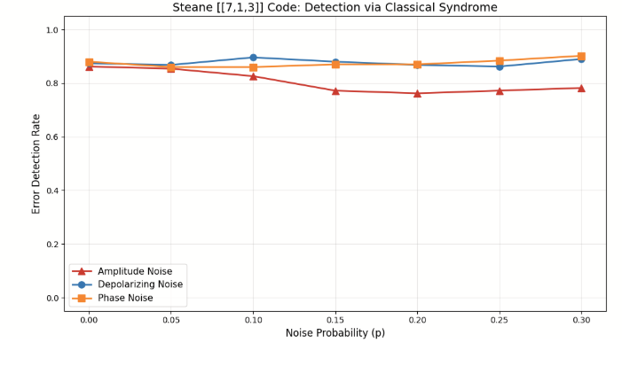

# QBER STABILITY IN MDI-QKD UNDER QUANTUM NOISE AND EAVESDROPPING 

## Research Question

How do different types of quantum noise (depolarising, phase damping, amplitude damping) and eavesdropping attacks affect the stability of the QBER in MDI-QKD, and to what extent can simple error correction strategies (such as repetition code and Hamming code) mitigate these effects to improve secure key generation?

## Key Terms and Definitions
#### Quantum Key Distribution (QKD):
A cryptographic method that uses quantum mechanics to allow two parties to securely generate a shared secret key.

#### Measurement-Device-Independent QKD (MDI-QKD):
A QKD protocol designed to eliminate detector-side attacks by introducing an untrusted intermediary (“Charlie”) who performs Bell-state measurements without learning the final key.

#### Quantum Bit Error Rate (QBER):
The percentage of bits received incorrectly during quantum communication. High QBER indicates either strong environmental noise, eavesdropping, or both.

#### Amplitude Damping Noise:
A noise channel representing energy loss, such as photon absorption, where quantum states decay from |1⟩ to |0⟩.

#### Phase Damping Noise (Dephasing):
A noise process that destroys quantum coherence without changing the energy state of the qubit.

#### Depolarising Noise:
A noise channel that randomly alters the quantum state, effectively acting as “white noise” in quantum systems.

#### Intercept-Resend Attack:
An eavesdropping strategy in which an attacker (Eve) measures transmitted qubits and sends replacement states, introducing detectable errors into the channel.

#### Quantum Error Correction (QEC)
Methods that protect quantum information from noise by encoding logical qubits into multiple physical qubits and correcting errors using syndrome measurements.

## Motivation

As quantum computing develops, the demand for secure quantum communication will increase dramatically,  which led to the creation of MDI QKD, a secure protocol where work was done last year in the larger topic of quantum cryptography. However, noise is the main challenge which is stunting the development of quantum communication. This is why we chose noise as the focus of our project for this year

The research question:

We chose this as it: 1. Built on a previous project 2. Was specific enough that we could create a plan very easily 3. Was simple enough to be realistic 

## Your next subsection

what did: 1. Phase 1: creating the noise

We had to understand the problem so we ran simulations with 3 different noise types, amplitude dampening which we can think of as the loss of energy for the photons. Then there’s phase dampening which is where the qubits lose their coherence – their superposition. We also explored depolarizing noise, which can be thought of as randomisation of the data, however as the QBER curve was the gentlest, we decided to ignore it going forward and focus on the other two.

Phase 2: solving the noise simply

We took the well known and established repetition code, and adapted it to be modular and to work for qubits, using a circuit based approach. This works by copying the data 3 times at the start and then reading the data in sections of 3 at the end. Whichever phase is most common is the one taken as correct. However it requires a lot of qubits to program and if there are 2n errors in it, it cannot be detected.

Phase 3: more complex error correction mechanisms

To get over the limitations of repetition code, we decide to implement Hamming code which uses parity checks (how many times a 1 comes up in a row in the classical sense) to calculate the exact position of an error. It also uses up much fewer qubits as we only need log base 2 n +1  correction bits compared to 2n extra bits in repetition code. There are a lot of ways to implement it in code, through matrices, through the classical grid method, through a circuit, through XORS and more. We tried all of them, and whilst in the end we got both the circuit and the matrices to work, the  challenges here were massive, especially in getting the programmes to work, due to their complexity. The easier they were to adapt to quantum, the harder they were classically and we ended up spending 2 and a half weeks on this, but we stumbled onto a new area of research

Phase 3.5 new area?

We realised we needed a way to convert quantum data to a classical algorithm, so we spent a day searching for algorithms to do this or work done in this area in general. What we found was essentially nothing, which surprised both of us, so we got our mentor to have a closer look. He found some papers – in bibliography  - but they proved to be of no use. Essentially what we had stumbled upon is an area which we believe has great potential, but has little development. Why do we believe that? Its because we’d be able to use already existing classical algorithms and infrastructure for communication, meaning that we’d avoid a large cost from investing in quantum resources instead, which would ultimately serve the same purpose. However, as its such a new area, and we eventually did manage to get the quantum version of hamming code to work, although we had to look at Steane code (closely related but not the same) to get it all to function.

Phase 4 – eavesdropping

We wanted to see how all of our work would stack up against an attempted attack so in the last few weeks, we worked to implement a man in the middle attack – aka eavsedroppiong where a secret third conn ection is involved. Why do we care about this so much ? unlike in classical computing, if anyone reads the data, the superposition goes away so the data is rendered useless, meaning it has a much wider impact than just not getting the data like in a classical attack of this sort.

## Future Work

In the end we  achieved pretty much everything we wanted to. We overcame great challenges and even stumbled onto a new area which may have some promise  (though like I said needs more development in it). So overall, we achieved what we set out to do and then some, meaning the project was a success.

Continously variable error correction code should be looked into, despite its challenges, as that would result in theoretically perfect message transmission.

## References

* **Basak, N., & Paul, G. (2025).** Resource Reduction in Multiparty Quantum Secret Sharing of both Classical and Quantum Information under Noisy Scenario. *arXiv preprint arXiv:2504.16709*.
* **Eater, B. (2020).** *What is error correction? Hamming codes in hardware*. YouTube. [Link](https://www.youtube.com/watch?v=h0jloehRKas)
* **Fletcher, A. I., et al. (2025).** An overview of CV-MDI-QKD. *Reports on Progress in Physics*, 88, 084001. [DOI: 10.1088/1361-6633/adf4f4](https://doi.org/10.1088/1361-6633/adf4f4)
* **Gisin, N., Ribordy, G., Tittel, W., & Zbinden, H. (2002).** Quantum cryptography. *Reviews of Modern Physics*, 74(1), 145–195. [DOI: 10.1103/RevModPhys.74.145](https://doi.org/10.1103/revmodphys.74.145)
* **Joseph, D., et al. (2022).** Transitioning organizations to post-quantum cryptography. *Nature*. [DOI: 10.1038/s41586-022-04623-2](https://doi.org/10.1038/s41586-022-04623-2)
* **Mermin, N. D.** *Quantum Computer Science: An Introduction*.
* **Preskill, J.** *Quantum Computing (CST Part II)*. University of Cambridge. [Link](https://www.cl.cam.ac.uk/teaching/1920/QuantComp/Quantum_Computing_Lecture_13.pdf)
* **Sanderson, G. [3Blue1Brown]. (2020).** *How to send a self-correcting message*. YouTube. [Link](https://www.youtube.com/watch?v=X8jsijhllIA)
* **Sanderson, G. [3Blue1Brown]. (2020).** *Hamming codes part 2, the elegance of it all*. YouTube. [Link](https://www.youtube.com/watch?v=b3NxrZOu_CE)
* **Shahid, A. B., et al. (2026).** Post-quantum cryptographic authentication protocol for industrial IoT using lattice-based cryptography. *Scientific Reports*, 16, 9582. [DOI: 10.1038/s41598-025-28413-8](https://doi.org/10.1038/s41598-025-28413-8)
* **Shi, S., et al. (2026).** Towards Minimal Fault-tolerant Error-Correction Sequence with Quantum Hamming Codes. *arXiv preprint arXiv:2601.10042*.
* **Subramani, S., et al. (2025).** Review of security methods based on classical cryptography and quantum cryptography. *Cybernetics and Systems*, 56(3), 302–320. [DOI: 10.1080/01969722.2023.2166261](https://doi.org/10.1080/01969722.2023.2166261)
* **Sun, Y., et al. (2025).** Analyzing the performance of CV-MDI QKD under continuous-mode scenarios. *Physical Review Applied*, 23, 014056. [DOI: 10.1103/PhysRevApplied.23.014056](https://doi.org/10.1103/PhysRevApplied.23.014056)
> The research poster for this project can be found in the [BeyondQuantum Proceedings 2026](https://thinkingbeyond.education/beyondquantum_proceedings_2026/).

