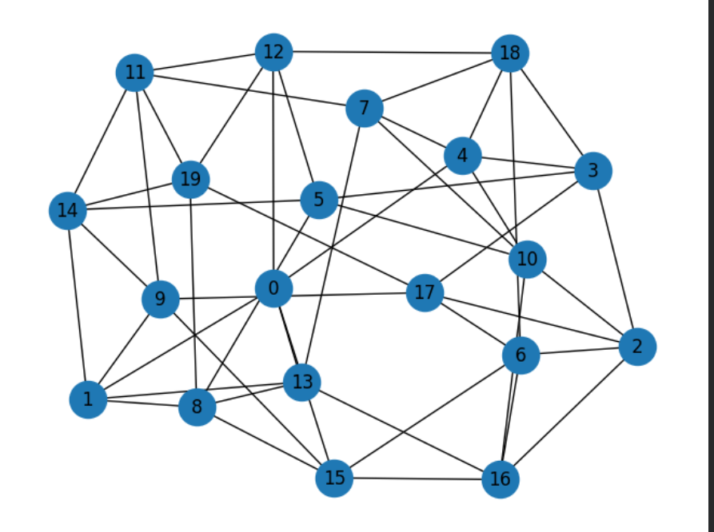

# QAOA vs. Classical Heurlistic

***Provide a description of your project including*** 

1. motivating your research question
2. stating your research question
3. explaining your method and implementation
4. Briefly mention and discuss your results
5. Draw your conclusions
6. State what future investigations 
7. State your references 

### Further Guidance: Formating
- Structure this readme using subsections
- Your job is to 
    - keep it clear
    - provide sufficient detail, so what you did is understandable to the reader. This way other researchers and future cohorts of BeyondQuantum will be able to build on your research
    - List all your references at the end
- utilise markdown like *italics*, **bold**, numbered and unnumbered lists to make your document easier to read
- if you refer to links use the respective markdown for links, e.g. `[ThinkingBeyond](https://thinkingbeyond.education/)`
- If you have graphs and pictures you want to embed in your file use ``
- If you want to present your results in a table use
    | Header 1            | Header 2  |
    |---------------------|-----------|
    | Lorem Ipsum         | 12345     |

**Tip:** Use tools to create markdown tables. For example, Obsidian has a table plugin, that makes creating tables much easier than doing it by hand.

## Research Question

How does the solution quality of the standard Quantum Approximate Optimization Algorithm (QAOA) and Sahni-Gonzalez Algorithm compare in MaxCut instances on small, 3-, 4-, and 5-regular graphs?

We tested unweighted graphs with 10, 16, and 20 nodes, with instances of 3-, 4-, and 5-regular graphs, in order to assess how the performance of QAOA scaled as the number of edges per node increases.

## Motivation

Optimization problems are commonplace in real-life, with broad applications in areas such as marketing, finance, and engineering. Many of these optimization problems can be formatted as a Max-Cut problem. Finding an exact solution to these max-cut problems becomes exponentially more difficult as the complexity of the graphs increase however, meaning that only approximate solutions can be found for graphs above a certain complexity. QAOA offers a potential alternative to the classical apporiximation algorithms and could have the potential to surpass the effectiveness of classical approximation ratios if QAOA is able to effectively scale to the complexity of modern day application of the Max-Cut problem.

## Methods

We randomly generated graphs with 10, 16, and 20 nodes, with each number of nodes having 3 instances with 3, 4, and 5 connections on each node (example graph shown below). To measure the solution quality of the QAOA and SG algorithm we implemented a brute force algorithm that found the optimal cut of each graph, comparing it to the output of both the QAOA and the SG algorithm. Additionally we measured the number of two-qubit gates in each circuit that was created and average them across the 30 tests we ran of each graph to get an accurate idea of the average number of circuits needed to run the QAOA.

## Results
We found that the QAOA consistently found equivalent or slightly better quality solutions than the SG algorithm, with the level of solution quality staying relatively consistent from 0.97-0.99 for all the graphs. And the SG algorithm ranging from 0.98-0.96

Additionaly we found that the number of two-qubit gates required to run the QAOA circuit increases in a roughly linear pattern, with the number of gates increasing alongside the number of connections as well. The number of two-qubit gates required more than doubled when going from 3-5 connections per node, indicating poor connection-wise scalability.

## Implications and Conclusion

Continue working through the points listed above with the help of sensibly named subsections. 

If you want to see some good examples of README files check out:
- [Example 1](https://github.com/ThinkingBeyond/BeyondAI-2024/blob/main/warenya-loulia/README.md)
- [Example 2](https://github.com/ThinkingBeyond/BeyondAI-2024/blob/main/shaana-karuna/README.md)

[ ... ]

## Future Work

State and explain what follow-up research could be conducted based on your work.

## References

List all your references here. Remember to put links into markdown. For example:

1.  Einstein, A. (1905). *On the Electrodynamics of Moving Bodies*. Annalen der Physik, 17, 891-921. [Internet Archive](https://archive.org/details/einstein-1905-relativity)

**Tip**: *If you have you references in BibTex, Google Scholar or Zotero*
1. Create/copy a list into ChatGPT
2. Ask it to turn it into an unsorted list in markdown

---

> The research poster for this project can be found in the [BeyondQuantum Proceedings 2026](https://thinkingbeyond.education/beyondquantum_proceedings_2026/).

